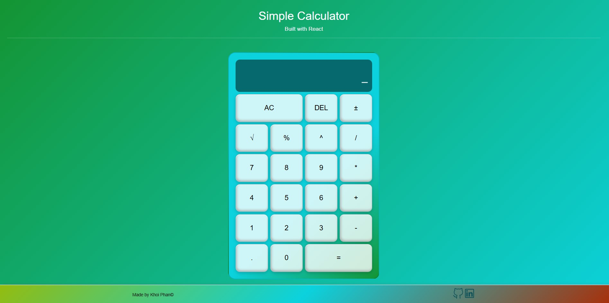
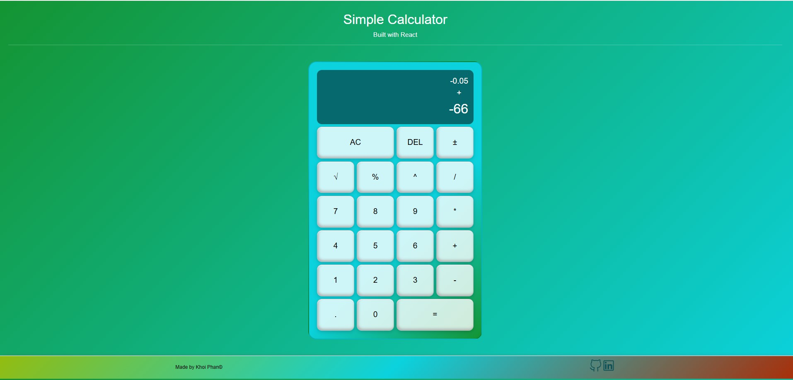

# React-Calculator-KP
  

react front end, js

## Description

React-Calculator-KP is a web-based calculator application built using React. It utilizes the `useReducer` hook to manage the calculator's state, making the logic for handling user input and operations both predictable and maintainable. The application supports basic arithmetic operations such as addition, subtraction, multiplication, and division. 

Key features include:
- **Responsive Design:** The interface adapts to different screen sizes for optimal usability on both desktop and mobile devices.
- **Clear State Management:** All calculator actions (number entry, operation selection, clearing, and evaluation) are handled through a reducer, ensuring consistent updates and easier debugging.
- **User-Friendly Interface:** Buttons are clearly labeled and laid out for intuitive use, with real-time display of input and results.
- **Error Handling:** The app gracefully handles invalid operations, such as division by zero, providing appropriate feedback to the user.

This project demonstrates effective use of React hooks and component-based architecture to build an interactive and reliable calculator.
## Installation and Running the App

Follow these steps to install and run React-Calculator-KP locally:

1. **Clone the repository:**
    ```bash
    git clone https://github.com/khoiphan-9194/React-Calculator-KP.git
    cd React-Calculator-KP
    ```

2. **Install dependencies:**
    ```bash
    npm install
    ```

3. **Start the development:**
    ```bash
    npm start
    ```

4. Open your browser and navigate to [http://localhost:3000](http://localhost:3000) to use the calculator.


## App Deployment
[CALCULATOR-----View Deployed Link](https://react-calculator-kp.onrender.com)

## Screenshots







## License
[](https://opensource.org/licenses/MIT)

## Questions?
  
### Github:[khoiphan-9194](https://github.com/khoiphan-9194)
  
### Reach Me Via Email: phanminhkhoi91@gmail.com

Thanks for viewing!


